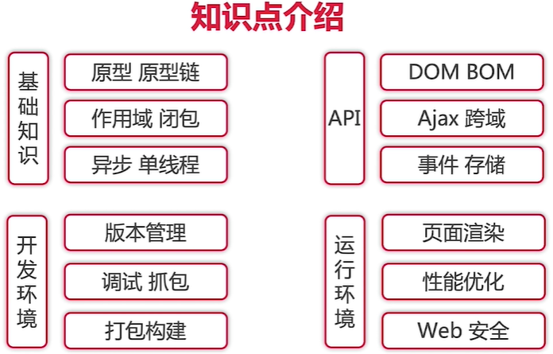
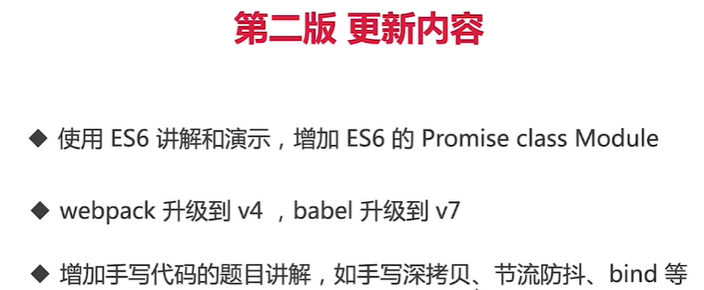

# 第1章 课程介绍

## 1.1 导学 

### 课程概述
+ 做什么？--讲解前端JS基础面试题
+ 哪些部分？--基础知识、JS Web api、开发环境、运行环境
+ 技术？--原型、作用于、异步、Ajax、事件、webpack等

### 知识点介绍

### 第2版更新内容

## 1.3 常见面试题举例

+ 1.typrof能判断那些类型
+ 2.何时用===何时用==
+ 3.window.onload和DOMContentLoaded的区别
+ 4.js创建10个`<a>`标签，点击时候弹出对应序号
+ 5.手写节流throttle、防抖debounce
+ 6.Promise解决说明问题

## 1.4 上一节问题的解析

> 拿到一道题目时候，我们最重要的知道这是考察什么考点，然后再去了解他的知识点。

+ 1.typrof能判断那些类型 `考JS变量类型`
+ 2.何时用===何时用== `强制类型转换`
+ 3.`window.onload`和`DOMContentLoaded`的区别 `页面加载过程`
+ 4.js创建10个a标签，点击时候弹出对应序号 `JS作用域`
+ 5.手写节流throttle、防抖debounce
+ 6.Promise解决什么问题？`性能、体验优化、JS异步`

## 1.5~1.6 知识体系

### 1.什么是知识体系
+ ①高效学习三部曲：找准知识体系；刻意训练；及时反馈；
+ ②知识体系：要有一个结构化的知识范围
+ ③涵盖所有知识点：结构化、有组织、易扩散

### 2.从那些方法梳理
+ ①可以从W3C标准出发（应用标准）
+ ②可以从ECMA262标准出发（语法标准）
+ ③开发环境（上线、开发、打包）
+ ④运行环境

### 3.我们的知识体系
+ 1.JS基础语法
+ 2.JS-web-API
+ 3.开发环境
+ 4.运行环境
