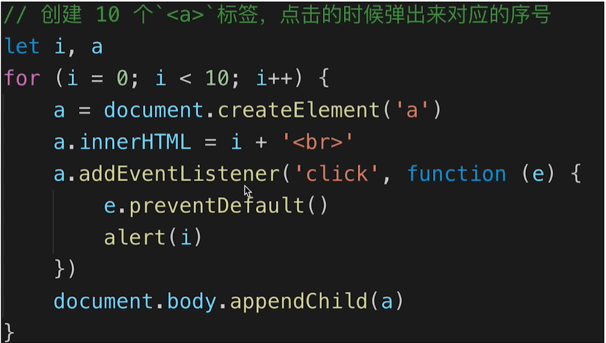

# 第4章 JS基础之作用域和闭包

## 4.1 作用域和闭包

### 常见题目

+ this的不用应用场景，如何取值？
+ 手写bind函数
+ 实际开发中闭包的应用场景，举例说明
+ 创建10个a标签，点击的时候弹出对应的序号
  > 

### 作用域分类

+ 全局作用域
+ 函数作用域
+ 块级作用域(ES6新增)

### 自由变量

+ 一个变量在当前作用域没有定义，但被使用了
+ 向上级作用域，一层一层一次寻找，直到找到为止
+ 如果全局作用域都没找到，则报错xx is not defined

