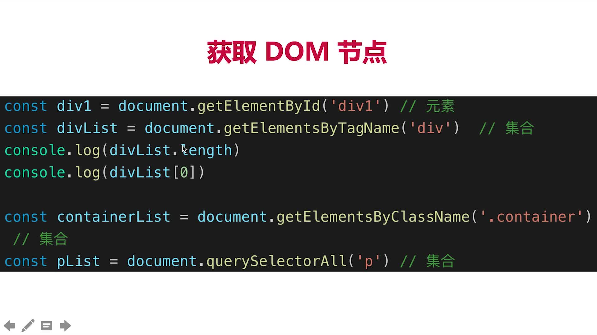
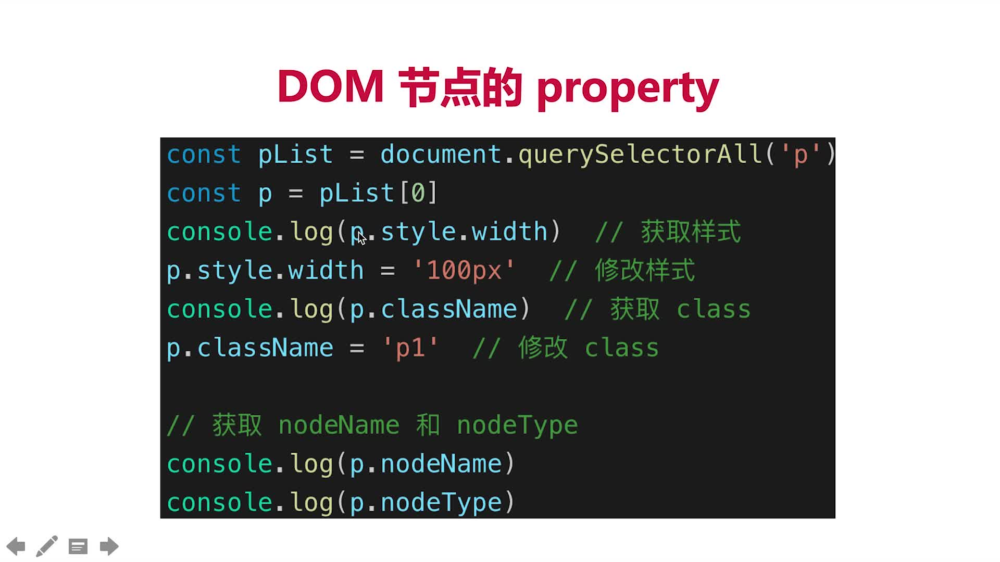
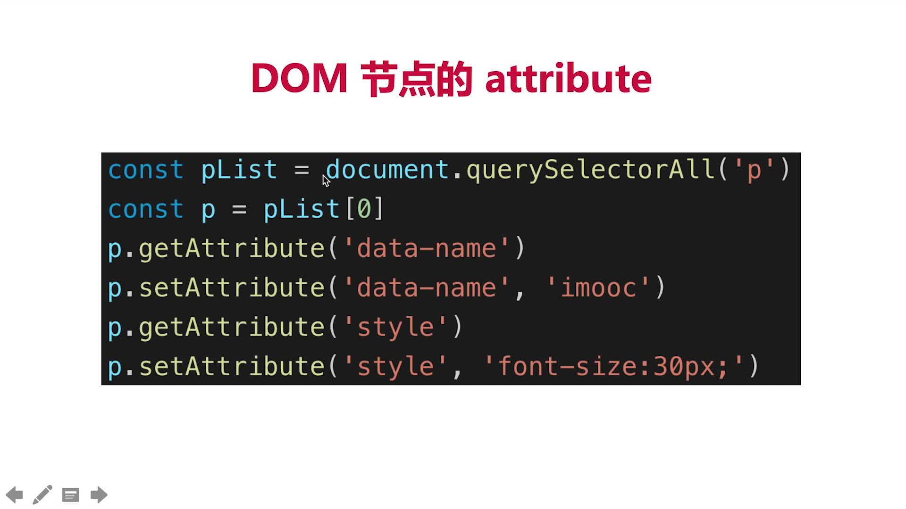
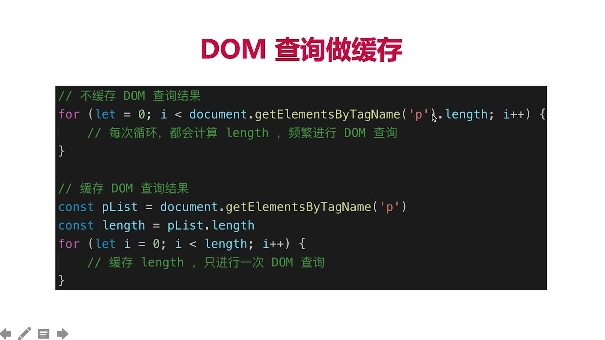
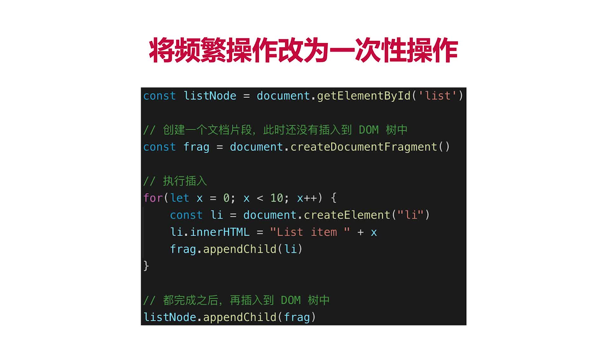

# 第6章 JS-Web-API-DOM

## 6.1 从JS基础到JS-Web-API

### JS规范

+ JS基础基础，规定语法(ECMA 262标准)
+ JS Web API，网页操作的API(W3C标准)
+ 前者是后者的基础，两者结合才能真正实际应用

### JS基础知识

+ 变量的类型和计算
+ 原型和原型链
+ 作用域和闭包

### JS Web API

+ DOM操作(document)
+ BOM操作(Browser)
+ 事件绑定
+ ajax
+ 存储

## 6.3 DOM的本质
> DOM(Document Object Model)

### 前言

+ vue和react框架应用广泛，封装了DOM操作
+ 但DOM操作一直都会是前端工程师的基础和必备知识
+ 只会vue而不会DOM操作的前端程序员，不会长久

### 题目

+ DOM是哪种数据结构
+ DOM操作的常用API
+ attribute和property的区别

### 知识点

+ DOM本质：一棵树
+ DOM节点操作
+ DOM结构操作
+ DOM性能

## 6.3 DOM节点操作

### DOM操作分类
+ 获取DOM节点
+ property
+ attribute


### DOM操作示例
+  1.获取DOM节点
  > 
+  2.property操作
  > 
+ 3.attribute操作
  > 

### DOM示例代码 `dom.html`和`dom.js`

> dom.html

```html
<!DOCTYPE html>
<html lang="en">
<head>
    <meta charset="UTF-8">
    <title>DOM操作</title>
    <style>
        .container {
            border: 1px solid #ccc;
        }

        .red {
            color: red;
        }
    </style>
</head>
<body>
<div id="div1" class="container">
    <p id="p1">一段文字1</p>
    <p id="p2">一段文字2</p>
    <p id="p3">一段文字3</p>
</div>
<div id="div2">
    
</div>
<script src="dom.js"></script>
</body>
</html>
```

> dom.js

```javascript
// 1.获取到元素
const div1 = document.getElementById('div1'); // 方式1：根据id拿到元素
console.log('div1', div1);
const divList = document.getElementsByTagName('div'); // 方式2：根据元素类型拿到所有的div元素
console.log('divList.length', divList.length);
console.log('divList[1]', divList[1]);
const containerList = document.getElementsByClassName('container'); // 方式3：根据类名拿到类名为container的所有元素
console.log('containerList.length', containerList.length);
console.log('containerList[0]', containerList[0]);
const pList = document.querySelectorAll('p'); // 方式4：类似getElementsByTagName
console.log('pList', pList);

// 2.操作property
const p = pList[1];
console.log(p.style.width); // 获取样式
p.style.width = '100px'; // 修改样式
console.log(p.className); // 获取class
p.className = 'red'; // 修改class,中间一个元素变成红色
// 获取nodeName 和 nodeType
console.log(p.nodeName);
console.log(p.nodeType);

// 3.操作attribute
p.getAttribute('data-name');
p.setAttribute('data-name', 'imooc');
p.getAttribute('data-name');
p.getAttribute('style');
p.setAttribute('style', 'font-size:30px');
```

### property和attribute
+ property:修改对象属性，不会体现到html结构中
+ attribute:修改html属性，会改变html结构
+ 两者都可能引起DOM重新渲染

## 6.4 DOM结构操作

### 新增/插入节点

> dom.js

```javascript
// 4.新增/插入/移动节点
const div_1 = document.getElementById('div1');
// 添加新节点
const p1 = document.createElement('p');
p1.innerHTML = 'this is p1';
// 添加新的元素
div_1.appendChild(p1);
// 移动已有节点，注意是移动！！！
const p2 = document.getElementById('p2');
div1.appendChild(p2);
```

## 6.5 DOM性能

+ DOM操作非常昂贵，避免频繁的DOM操作
+ 对DOM查询做缓存
  > 
+ 将频繁操作改为一次操作
  > 
