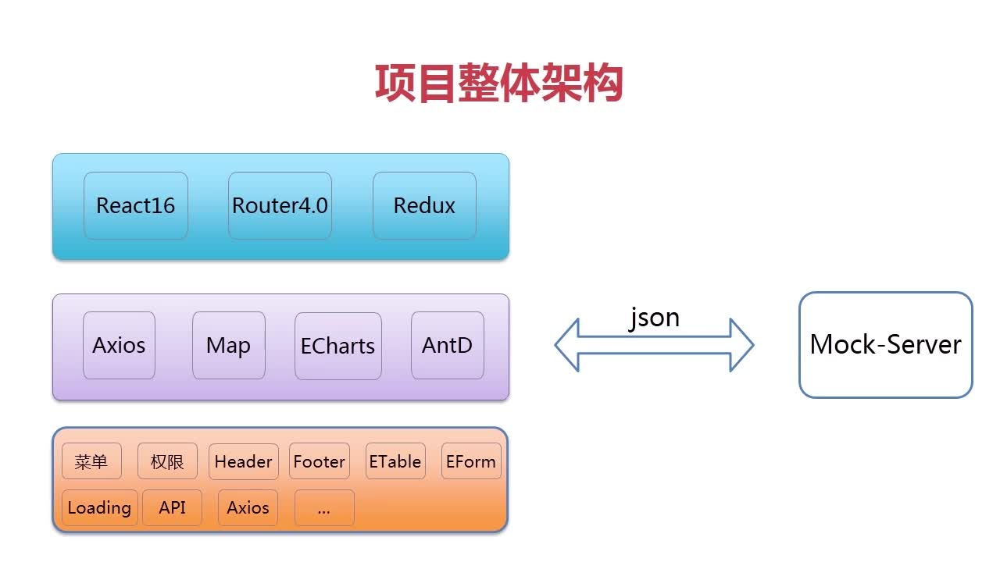

# 课程导学

## 产品需求

+ 技术选型
+ 项目架构
+ 项目规范
+ 封装公共机制
+ 提高开发效率

## 课程概述

+ React全家桶
  + React基础知识、生命周期
  + Router4.0语法讲解
  + Redux集成开发
+ AntD UI组件
  + 最实用基础组件
  + AntD栅格系统
  + ETable组件封装
  + BaseForm组件封装
  + 表格内嵌单选、复选封装
+ 公共机制封装
  + Axios请求插件封装
  + API封装
  + 错误拦截
  + 权限、菜单封装
  + 金额、日期、手机号封装......
  + Loading、分页、Mock......

## 项目特色

+ 前沿的技术栈
+ 健全的架构
+ 丰富的UI组件
+ 共享单车项目

## 项目架构

## 课程安排

+ 第1章 React基础知识
+ 第2章 主页面架构
+ 第3章 Router4.0路由实战演练
+ 第4~6章 常用UI组件
+ 第7~8章 单车业务基本功能开发
+ 第9章 项目工程化开发
+ 第10~13章 单车业务核心模块开发
+ 第14章 Redux集成

## 课程收货

+ React全家桶技能
+ 地图和React的集成
+ 前端图表的开发技巧
+ 掌握基于React的UI框架--AntD
+ 前端后台框架设计、公共机制封装、后台管理系统开发经验