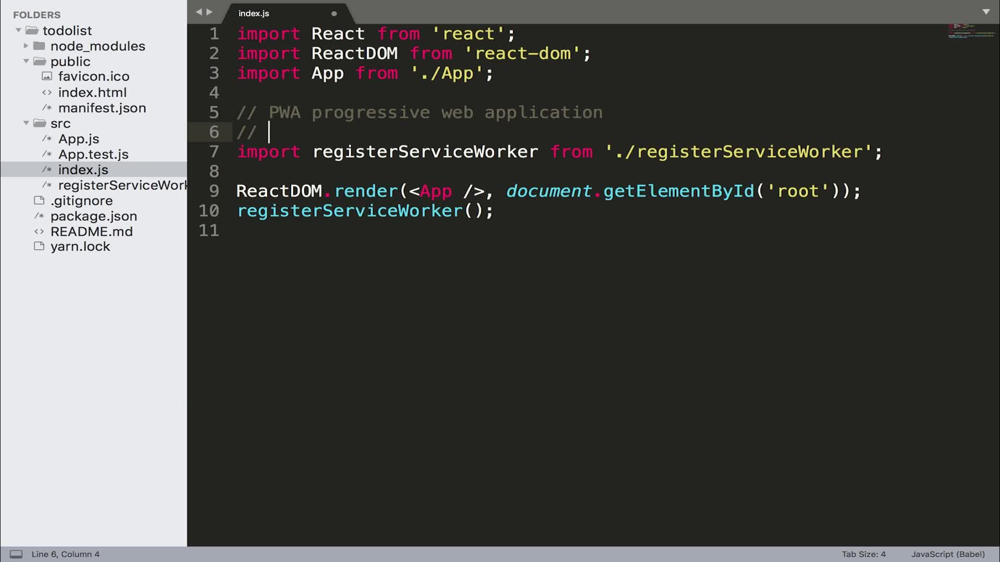
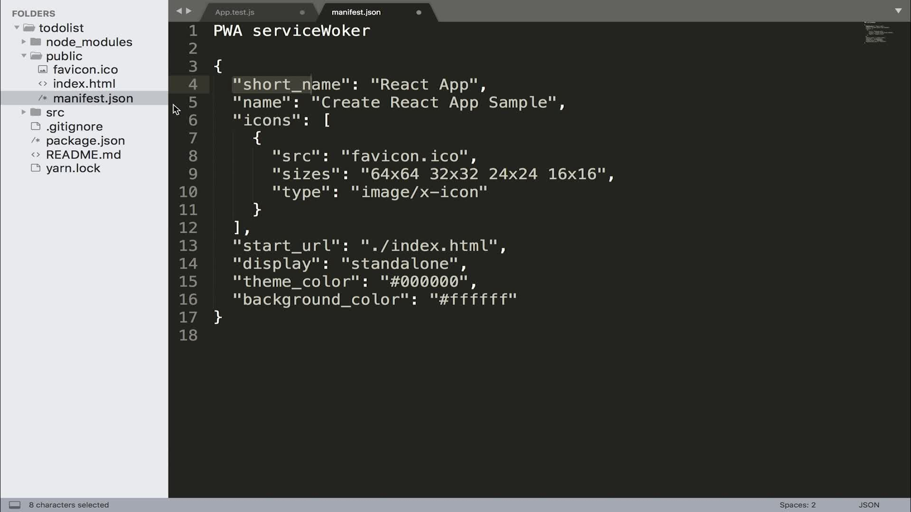

# 第2章 React初探

## 一、React特点

+ Facebook在2013年开源
+ 函数式编程
+ 使用人数最多的前端框架
+ [健全的文档](https://reactjs.org)和[完善的社区](http://react-china.org)
+ React 16版本之后称之为 React Fiber 
  > 这么称是因为在React 16版本之后，在底层在事件循环中加入了优先级这样的概念，可以在循环的碎片事件可以执行高优先级的交互。
+ React 相对于vue 更灵活，做复杂度高的项目更加自如。Vue更适合小项目

## 二、项目目录和结构

### 项目初始化

+ 1、安装脚手架工具
  ```bash
  npm install -g create-react-app
  ```
+ 2、到工程所在目录创建react工程
  ```bash
  npx create-react-app my-app
  ```
+ 3、根据创建完成后的提示运行工程
  
    ```bash
    cd my-app
    npm start
    ```
### React目录规范

> 参考博客 https://juejin.im/post/58cbfcb05c497d0057b9b228 ，博客里最推荐的目录结构如下

```json
├── src                      # 程序源文件
│   ├── main.js              # 程序启动和渲染
│   ├── components           # 全局可复用的表现组件(Presentational Components)
│   ├── containers           # 全局可复用的容器组件
│   ├── layouts              # 主页结构
│   ├── store                # Redux指定块
│   │   ├── createStore.js   # 创建和使用redux store
│   │   └── reducers.js      # Reducer注册和注入
│   └── routes               # 主路由和异步分割点
│       ├── index.js         # 用store启动主程序路由
│       ├── Root.js          # 为上下文providers包住组件
│       └── Home             # 不规则路由
│           ├── index.js     # 路由定义和代码异步分割
│           ├── assets       # 组件引入的静态资源
│           ├── components   # 直观React组件
│           ├── container    # 连接actions和store
│           ├── modules      # reducers/constants/actions的集合
│           └── routes **    # 不规则子路由(** 可选择的)
```

### 关于demo代码

当前目录的[demo](demo)项目可以用于react基础项目模板，改一下package.json里的name即可

### PWA

> If you want your app to work offline and load faster(what we call unregister() to register() below. Note this comes with some pitfalls.	PWA:progressive web application), you can change unregister() to register() below. Note this comes with some pitfalls.

PWA Progress web application 渐进式应用开发，指地是移动端开发，本地缓存网页从而可以离线访问,仅支持https协议，一般用不到可以去掉(顺便去掉registerServiceWorker.js)

```javascript
// 在src/index.js中
import registerRerviceWorker from './registerServiceWorker';
registerServiceWorker();
```



### manifest.json

> manifest.json用于配合serviceWorker实现PWA，可以把webapp缓存下来，在手机桌面添加快捷方式(manifest.json的内容就是定义快捷方式的图标等参数的)，从而可以直接以类似本地app的方式进行调用.也可以删除掉



## 三、语法理解

### 1.解构语句

> python中最早有的，es6引入，用于用变量数组接受返回值里的多个变量

```javascript
import { Component } from ‘react’
```
  等价于
```javascript
import React from ‘react’
const Component = React.Component
```

### 2.ReactDOM是一个第三方模块，它有个方法render帮我们把组件app挂载到页面的某个节点下

> 除了src/index.js，其他的组件都不需要引入ReactDOM,只需要引入React，从而能写jsx语法就行了。render的jsx语法必须react支持，只有最后挂载到index.html上时才需要ReactDOM

**比如`src/App.js`，`render(){}`函数里面可以写jsx语法，一般这里用于聚合所有组件，整合成一个SPA应用**

```javascript
import React, {Component} from 'react';

class App extends Component {
    render() { // `render(){}`函数里面可以写jsx语法，一般这里用于聚合所有组件，整合成一个SPA应用
        return (
            <div>
                最简单的react案例，可用来当所有react项目的基础模板,这里可以组合和聚合其他所有的组件，对外提供SPA应用
            </div>
        );
    }
}

export default App;
```

**然后在`src/index.js`中引入App.js，通过index.js里面的`ReactDOM.render()`函数把App.js里面的所有内容渲染到`public/index.html`中的`<div id="root"></div>`里**

src/index.js

```javascript
import React from 'react'; // 这里react必须引入，因为要把render函数里用到了jsx语法
import ReactDOM from 'react-dom';
import './index.css'
import App from './App';

ReactDOM.render(<App/>, document.getElementById('root')); // `render()`函数把App.js里面的所有内容渲染到`public/index.html`中的`<div id="root"></div>`
```

public/index.html，**最终被渲染到这里的id为root的div下**

```html
<!DOCTYPE html>
<html lang="en">
<head>
    <meta charset="utf-8"/>
    <meta
            name="viewport"
            content="width=device-width, initial-scale=1, shrink-to-fit=no"
    />
    <meta name="theme-color" content="#000000"/>
    <title>first demo</title>
</head>
<body>
<noscript>You need to enable JavaScript to run this app.</noscript>
<!--  把src/index.js里的内容渲染到下面的div中  -->
<div id="root"></div>
</body>
</html>
```

### 3.如果你在项目中用了jsx语法 你就一定要引用react，在react中 render函数中的标签也是jsx语法

> jsx自定义组件名以大写字母开头，不支持小写，小写为html标签
