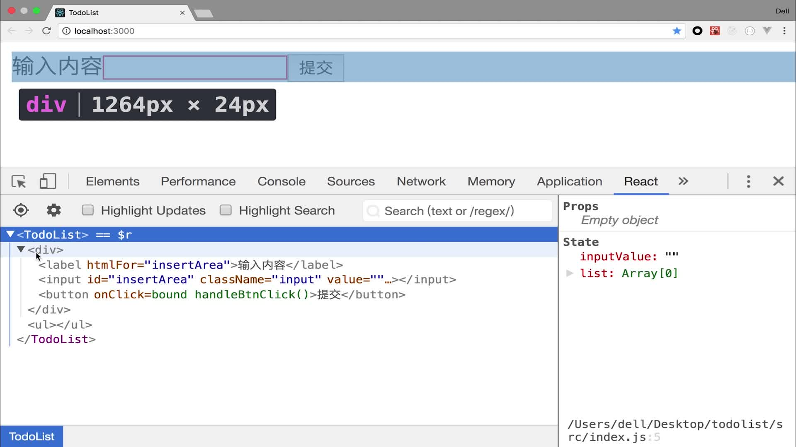

# 第4章 React高级内容

+ **4.1~4.7React基础高级**的代码都在[todolist](todolist)里
+ **4.8生命周期钩子函数**的代码在[todolist_lifecycle](todolist_lifecycle)中
+ **4.9生命周期钩子函数使用场景**的代码在[todolist_lifecycle_in_action](todolist_lifecycle_in_action)
+ **4.10~4.14动画相关**在[transition](transition)中

## 4.1 React的Chrome扩展程序

> 在 [Chrome网上应用店](https://chrome.google.com/webstore/category/extensions)搜索下面的插件安装即可

+ [react-developer-tools](https://chrome.google.com/webstore/detail/react-developer-tools/fmkadmapgofadopljbjfkapdkoienihi)
  > 在react应用网页上右键检查，在控制台有个"React"的tab页就是此插件监控的内容.在这里可以看到state里面的值、子元素、回调函数和页面的组件情况等，就不用像前面那样用console打印中间值了
  
+ [redux-devtools](https://chrome.google.com/webstore/detail/redux-devtools/lmhkpmbekcpmknklioeibfkpmmfibljd)
  >  在react应用网页上右键检查，在控制台有个"Redux"的tab页就是此插件监控的内容.这里可以监控到Redux里面所有的全局变量和全局方法
  
## 4.2 PropTypes与DefaultProps用于组件属性的强校验 [代码](todolist/src/TodoItem.js#L35)

> 参考文档：https://react.docschina.org/docs/typechecking-with-proptypes.html#proptypes 和 https://react.docschina.org/docs/typechecking-with-proptypes.html#%E5%B1%9E%E6%80%A7%E9%BB%98%E8%AE%A4%E5%80%BC

导入代码如下

```javascript
import PropTypes from 'prop-types';
```

+ 1.propTypes对属性进行强校验，验证格式是否正确（number，string，array、bool、func、number、object等），isRequired是必须要传的意思，不能不传
+ 2.defaultProps设置默认的属性值

```jsx
// 对组件属性的数据类型进行校验，限制父组件传过来的数据的类型和是否传递，一旦不符合要求就会有告警提示
TodoItem.propTypes = {
    test: PropTypes.string.isRequired, // 设置属性为必传
    // content: PropTypes.oneOfType([PropTypes.string, PropTypes.number]), // 设置多个默认数据类型
    content: PropTypes.string,
    deleteItem: PropTypes.func,
    index: PropTypes.number
};

// 为属性设置默认值
TodoItem.defaultProps = {
    test: "just for test",
};
```

## 4.3  props，state 与 render 函数的关系

+ 1.当组件的state或props发生改变时，render就会重新执行
+ 2.当父组件的render函数被运行时，它的子组件的render都会被重新执行
  > 子组件的理解：在当前组件import并在jsx中使用其他组件，那么被使用的其他组件就是当前组件的子组件，比如代码[todolist](todolist)中的[TodoItem](todolist/src/TodoItem.js)和[Test](todolist/src/Test.js)都是[TodoList](todolist/src/TodoList.js)的子组件
  
## 4.4~4.6 虚拟DOM

### 原理
+ 1.state数据
+ 2.jsx模板
+ 3.数据+模板的结合生成真实dom现实
+ 4.生成虚拟的dom（虚拟dom就是一个js对象，用他来描述真实的dom）
+ 5.state发生变化
+ 6.生成新的虚拟dom
+ 7.比较原始虚拟dom和新的虚拟dom的区别，并找到“区别”
+ 8.直接操作dom，改变不一样的那个“区别”

### 优点

+ 1.性能提升了
+ 2.它使得跨端应用得以实现，由此产生React Native。因为原生应用中是没有DOM这个概念的，不过虚拟DOM的js对象可以被正常识别，因此只要加一层判断辨别是浏览器还是原生app即可将虚拟DOM的思想引入从而使react可以开发原生app

### React 中虚拟dom(js对象)的 diff 算法原理

+ 1.diff算法： 找原始虚拟dom 和新的虚拟dom直接的差异。
+ 2.数据发生改变的时候才会产生diff 算法。(state 或者 props 发生改变的时候，也就是 调用 SetState()的时候)
+ 3.虚拟dom同级比对，发现某一层dom 不对的话，其他的就不比对了，就会把这层以下的所有的dom全部替换为新的虚拟dom
+ 4.虚拟dom在循环的时候能不用index做key值尽量不用

### 虚拟DOM的diff算法特点

+ 1.setState方法是异步的，可以把多次setState统一到一起，减少DOM比对的次数
+ 2.虚拟DOM是同级比对的，如果比对有差异，下面级别的就不用比对了，直接把替换下面所有的级别
+ 3.虚拟DOM循环的时候，要给定一个唯一的Key（最好是唯一标识ID之类的，不能重复的），不要使用索引作为Key

## 4.7 ref的使用(直接操作dom，不推荐)

+ 0.dom元素响应事件中，可以用事件参数event的event.target.value来获取dom元素的值(如果有的话)，e.target就是当前操作的dom节点元素.但是并不方便，ref就是为了方便引用dom应运而生地
+ 1.ref可以帮助我们获取DOM元素：`<input ref={(input) => { this.input = input }} />`调用的时候就直接写`this.input`
+ 2.setState是异步函数,会晚一点执行，或者整合执行，总之不会立即执行`setState( () =({}),  () ={} )`
  > 第一个参数是设置新的state，第二个参数是setState完成后的回调函数，如果想获取state更新后的dom节点，就必须写在回调函数里，有个先后顺序。
this.ol.querySelectorAll('div').length获取ol里div的长度(个数)
+ 3.有的时候ref和setstate合用的时候会出现一些坑，dom获取并不及时，原因就是setState是异步的，将ref放到setState的回调函数里就不会有问题了.
  > ref是react中获取DOM节点的方法，尽量不使用（除了复杂的操作） ，如果使用的话最好放在`setState（（）=>（），（）=>{要在setState完成后执行的操作}）`第二个回调函数内
  
## 4.8 React的生命周期函数

> 见总结[todolist_lifecycle/README.md](todolist_lifecycle/README.md)

## 4.9 React生命周期函数使用场景

> 见 [todolist_lifecycle_in_action/README.md](todolist_lifecycle_in_action/README.md)

+ **ajax 请求，因为只请求一次** 所以不放在render()函数里面执行，建议放在componentDidMount执行；放在componentwillMount可能会和rn开发有冲突 [示例代码](todolist_lifecycle_in_action/src/TodoList.js#L42)
+ **父组件数据发生变化时，子组件也会刷新** 但是很多时候的刷新是不必要的，可以在生命周期函数(shouldComponentUpdate)中加以判断，只有特定条件下子组件才更新 [示例代码](todolist_lifecycle_in_action/src/TodoItem.js#L10)

## 4-10 Charles本地mock(其实也可以使用[Esay Mooc](https://easy-mock.com)网站)


## 4-11~4-14 React动画

> 用animate.css这个第三方库

> [库主页](https://github.com/daneden/animate.css)

### 安装

```bash
yarn add animate.css
yarn add react-addons-css-transition-group
```

### 导入到组件

```javascript
import "animate.css";
import ReactCSSTransitionGroup from "react-addons-css-transition-group";
```

### 使用范例

> [代码示例](transition/src/App.js#L4)

```jsx
import React, {Component, Fragment} from 'react';
// 自定义的CSS动画
import './App.css'
// 第三方动画组件库
import "animate.css";
import ReactCSSTransitionGroup from "react-addons-css-transition-group";

class App extends Component {

    constructor(props) {
        super(props);
        this.state = {
            show: true,
            fadeName: 'animated bounceInLeft'
        };
        // 方法绑定当前对象，提高性能、简化写法
        this.handleToggle = this.handleToggle.bind(this);
    }

    render() {
        return (
            <Fragment>
                {/*1. 自己实现的CSS动画效果*/}
                <div className={this.state.show ? 'Show' : 'Hide'}>hello</div>
                <button onClick={this.handleToggle}>toggle</button>

                <ReactCSSTransitionGroup
                    transitionEnter={true}
                    transitionLeave={true}
                    transitionEnterTimeout={2500}
                    transitionLeaveTimeout={1500}
                    transitionName="animated"
                >
                    {/*这里一定要加上key*/}
                    {/*className是animate.css中的类名，显示不同动画,见https://github.com/daneden/animate.css*/}
                    <div key="amache" className={this.state.fadeName} >
                        
                    </div>
                </ReactCSSTransitionGroup>
            </Fragment>
        );
    }

    // 取反动画
    handleToggle() {
        this.setState({
            show: !this.state.show,
            fadeName:'animated bounceInRight'
        });
    }
}

export default App;
```

### 更多的动画效果见下图

> [在线尝试](https://daneden.github.io/animate.css/),[更多动画效果](https://github.com/daneden/animate.css#animations)

| 效果类名           |                    |                     |                      |
| ----------------- | ------------------ | ------------------- | -------------------- |
| `bounce`          | `flash`            | `pulse`             | `rubberBand`         |
| `shake`           | `headShake`        | `swing`             | `tada`               |
| `wobble`          | `jello`            | `bounceIn`          | `bounceInDown`       |
| `bounceInLeft`    | `bounceInRight`    | `bounceInUp`        | `bounceOut`          |
| `bounceOutDown`   | `bounceOutLeft`    | `bounceOutRight`    | `bounceOutUp`        |
| `fadeIn`          | `fadeInDown`       | `fadeInDownBig`     | `fadeInLeft`         |
| `fadeInLeftBig`   | `fadeInRight`      | `fadeInRightBig`    | `fadeInUp`           |
| `fadeInUpBig`     | `fadeOut`          | `fadeOutDown`       | `fadeOutDownBig`     |
| `fadeOutLeft`     | `fadeOutLeftBig`   | `fadeOutRight`      | `fadeOutRightBig`    |
| `fadeOutUp`       | `fadeOutUpBig`     | `flipInX`           | `flipInY`            |
| `flipOutX`        | `flipOutY`         | `lightSpeedIn`      | `lightSpeedOut`      |
| `rotateIn`        | `rotateInDownLeft` | `rotateInDownRight` | `rotateInUpLeft`     |
| `rotateInUpRight` | `rotateOut`        | `rotateOutDownLeft` | `rotateOutDownRight` |
| `rotateOutUpLeft` | `rotateOutUpRight` | `hinge`             | `jackInTheBox`       |
| `rollIn`          | `rollOut`          | `zoomIn`            | `zoomInDown`         |
| `zoomInLeft`      | `zoomInRight`      | `zoomInUp`          | `zoomOut`            |
| `zoomOutDown`     | `zoomOutLeft`      | `zoomOutRight`      | `zoomOutUp`          |
| `slideInDown`     | `slideInLeft`      | `slideInRight`      | `slideInUp`          |
| `slideOutDown`    | `slideOutLeft`     | `slideOutRight`     | `slideOutUp`         |
| `heartBeat`       |                    |                     |                      |


