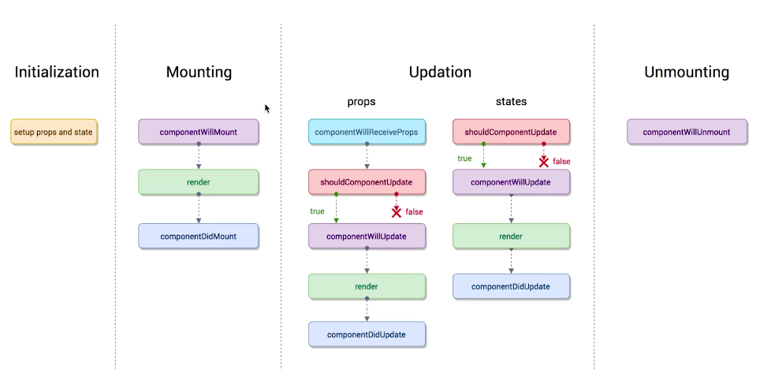

# React的生命周期函数

> 在某一个时刻组件会自动执行的函数

## 一、参考教程

+ [React 组件生命周期](http://www.runoob.com/react/react-component-life-cycle.html)
+ [React：组件的生命周期](https://segmentfault.com/a/1190000004168886?utm_source=tag-newest)

## 二、React生命周期图示

> Updation应该为Updating?



## 三、React 组件生命周期钩子函数详解

### 1.组件的生命周期可分成三个状态：

+ **Mounting**：已插入真实 DOM
+ **Updating**：正在被重新渲染
+ **Unmounting**：已移出真实 DOM

### 2.生命周期的方法有：

+ **componentWillMount** 在渲染前调用,在客户端也在服务端
+ **componentDidMount** 在第一次渲染后调用，只在客户端。之后组件已经生成了对应的DOM结构，可以通过this.getDOMNode()来进行访问。 如果你想和其他JavaScript框架一起使用，可以在这个方法中调用setTimeout, setInterval或者发送AJAX请求等操作(防止异步操作阻塞UI)
+ **componentWillReceiveProps** 在组件接收到一个新的 prop (更新后)时被调用。这个方法在初始化render时不会被调用
+ **shouldComponentUpdate** 返回一个布尔值。在组件接收到新的props或者state时被调用。在初始化时或者使用forceUpdate时不被调用。 可以在你确认不需要更新组件时使用
+ **componentWillUpdate** 在组件接收到新的props或者state但还没有render时被调用。在初始化时不会被调用
+ **componentDidUpdate** 在组件完成更新后立即调用。在初始化时不会被调用
+ **componentWillUnmount** 在组件从 DOM 中移除之前立刻被调用

这些方法的详细说明，可以参考[官方文档](https://reactjs.org/docs/react-component.html#lifecycle-methods)

## 四、代码示例

> 下面在一个html文件中实践react代码的方式很值得借鉴

+ `react.development.js` 支持jsx
+ `react-dom.development.js` 用于虚拟dom渲染页面
+ `babel.min.js` 可以编译es6语法

### 1.以下实例在 Hello 组件加载以后，通过 componentDidMount 方法设置一个定时器，每隔100毫秒重新设置组件的透明度，并重新渲染

> [在线尝试](https://www.runoob.com/try/try.php?filename=try_react_life_cycle)

```html
<!DOCTYPE html>
<html>
<head>
<meta charset="UTF-8" />
<title>React 实例</title>
<script src="https://cdn.staticfile.org/react/16.4.0/umd/react.development.js"></script>
<script src="https://cdn.staticfile.org/react-dom/16.4.0/umd/react-dom.development.js"></script>
<script src="https://cdn.staticfile.org/babel-standalone/6.26.0/babel.min.js"></script>
</head>
<body>


<script type="text/babel">
class Hello extends React.Component {
 
  constructor(props) {
      super(props);
      this.state = {opacity: 1.0};
  }
 
  componentDidMount() {
    this.timer = setInterval(function () {
      var opacity = this.state.opacity;
      opacity -= .05;
      if (opacity < 0.1) {
        opacity = 1.0;
      }
      this.setState({
        opacity: opacity
      });
    }.bind(this), 100);
  }
 
  render () {
    return (
      <div style={{opacity: this.state.opacity}}>
        Hello {this.props.name}
      </div>
    );
  }
}
 
ReactDOM.render(
  <Hello name="world"/>,
  document.body
);
</script>

</body>
</html>
```

### 2.以下实例初始化 state ， setNewnumber 用于更新 state。所有生命周期在 Content 组件中

> [在线尝试](https://www.runoob.com/try/try.php?filename=try_react_life_cycle2)

```html
<!DOCTYPE html>
<html>
<head>
<meta charset="UTF-8" />
<title>React 实例</title>
<script src="https://cdn.staticfile.org/react/16.4.0/umd/react.development.js"></script>
<script src="https://cdn.staticfile.org/react-dom/16.4.0/umd/react-dom.development.js"></script>
<script src="https://cdn.staticfile.org/babel-standalone/6.26.0/babel.min.js"></script>
</head>
<body>
<div id="example"></div>

<script type="text/babel">
class Button extends React.Component {
  constructor(props) {
      super(props);
      this.state = {data: 0};
      this.setNewNumber = this.setNewNumber.bind(this);
  }
  
  setNewNumber() {
    this.setState({data: this.state.data + 1})
  }
  render() {
      return (
         <div>
            <button onClick = {this.setNewNumber}>INCREMENT</button>
            <Content myNumber = {this.state.data}></Content>
         </div>
      );
    }
}


class Content extends React.Component {
  componentWillMount() {
      console.log('Component WILL MOUNT!')
  }
  componentDidMount() {
       console.log('Component DID MOUNT!')
  }
  componentWillReceiveProps(newProps) {
        console.log('Component WILL RECEIVE PROPS!')
  }
  shouldComponentUpdate(newProps, newState) {
        return true;
  }
  componentWillUpdate(nextProps, nextState) {
        console.log('Component WILL UPDATE!');
  }
  componentDidUpdate(prevProps, prevState) {
        console.log('Component DID UPDATE!')
  }
  componentWillUnmount() {
         console.log('Component WILL UNMOUNT!')
  }
 
    render() {
      return (
        <div>
          <h3>{this.props.myNumber}</h3>
        </div>
      );
    }
}
ReactDOM.render(
   <div>
      <Button />
   </div>,
  document.getElementById('example')
);
</script>

</body>
</html>
```
