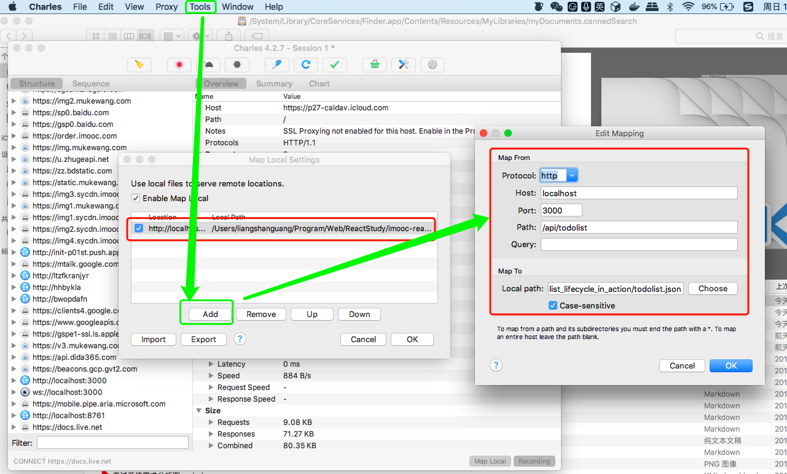

# 说明

## 生命周期函数的使用场景
+ ajax 请求，因为只请求一次，所以不放在render()函数里面执行，建议放在componentDidMount执行；放在componentwillMount可能会和rn开发有冲突
+ 父组件数据发生变化时，子组件也会刷新，但是很多时候的刷新是不必要的，可以在生命周期函数(shouldComponentUpdate)中加以判断，只有特定条件下子组件才更新

## Charles创建REST接口

