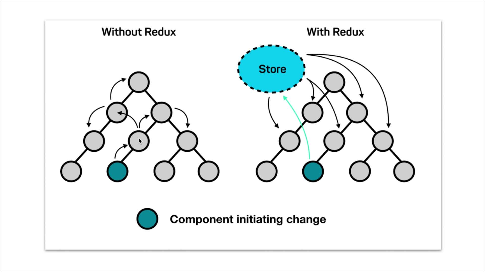
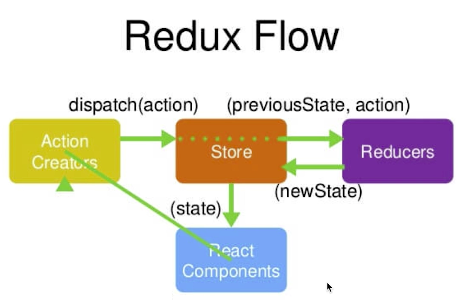
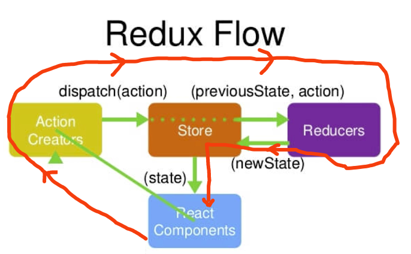

# 第5章 Redux入门

> Redux = Reducer + Flux，字面意思是流动的意思，Flux是React早期的Redux, Redux是Flux的升级，升级之处就是新增了Reducer

参考资料

+ [Redux文档中文翻译](https://www.redux.org.cn/)
+ [Redux文档英文原版](https://redux.js.org/introduction/getting-started)
+ [react-reudx之@connect 摆脱redux的繁琐操作](https://www.jianshu.com/p/269473787332)
+ [redux 终于搞明白store reducer action之间的关系](https://www.jianshu.com/p/21960f78937d)

## 一、有无Redux的区别


+ react只是一个轻量级的视图层框架，如果要做大型应用就要搭配视图层框架redux一起使用
+ redux组件之间的传值非常简单，redux里面要求我们把数据都放在一个公共的存储区域store里面，组件之中尽量少放数据，也就是所有数据都不放在组件自身了，都把它放到一个公用的存储空间里面，然后组件改变数据就不需要传递了，改变store里面的数据之后其它的组件会感知到里面的数据发生改变。这样的话不管组件的层次有多深，但是走的流程都是一样的，会把数据的传递简化很多。而父子、兄弟组件之间通信当层级多了会变地极其繁琐。
+ redux把数据都放在Store里面，组件改变Store里面的数据，其他组件能感知到Store数据的变化，如果有变化，就获取新的数据，从而达到组件数据传递的功能
+ store类似于全局变量，但是store更强大的地方在于能主动去刷新所有用到store的组件。类似的还有Vue中的Vuex

## 二、Redux的设计理念和设计原则

+ redux的**设计理念**: 将数据放在store中. 通过action修改
+ redux三大**设计原则**:
  + 单一数据源(store中存储数据)
  + store是只读的(想要修改store只能使用action, 其他方法不可以修改)
  + 使用纯函数修改(即reducer)
  
## 三、Redux的工作流程

### 1.store的数据流图  务必好好理解




redux是视图层框架，把所有数据都放在store之中，每个组件都要从store里拿数据，然后每个组件也要去改store里面的数据，

举例：把这个流程理解成一个图书馆的流程

+ **react compontents**:借书的人
+ **action creators**:“要借什么书”这句话（语句的表达，数据的传递）
+ **store**:图书馆管理员（没办法记住所有书籍的存储情况）
+ **reducers**:图书馆管理员的记录本（要借什么书，先查有没有，要还的书查一下放到某个位置）

> 借书的人(react compontent)------>我要借一本书(dispatch action，即action creator)---->图书管理员听见(store监听到)--->查阅reducers手册，去store找书，把对应的书给借书人(执行Reducers中方法，改变store里的值，然后实时对component生效)

### 2.store初始化

+ **第1步**：npm安装Redux `npm install --save redux`或者`yarn add redux`
+ **第2步**：在store文件夹下创建index.js，并导入

  ```javascript
  import { createStore } from 'redux'
  
  const store = createStore(reducer);
  
  export store;
  ```

+ **第3步**：在store文件夹下创建reducer.js

  ```javascript
  const defaultState = {
      inputValue:'123'
  };

  export default (state = defaultState, action) => {
      return state;
  }
  ```

+ **第4步**：在组件(比如TodoList.js)中引入
  
  + 先`import store from './store'` [代码](todolist-antd-store-basic/src/TodoList.js#L5)
  + 然后 `this.state = store.getState()` [代码](todolist-antd-store-basic/src/TodoList.js#L10)

### 3.改变store中的数据(redux的核心流程)

> 本部分代码见 [todolist-antd-store-basic](todolist-antd-store-basic)

+ **第1步**：react要改变store里的数据，先要派发一个action，action通过dispatch(action)方法传给store [代码](todolist-antd-store-basic/src/TodoList.js#L39)

    ```javascript
    // src/TodoList.js
    // 修改store第1步：创建action，并通过dispatch传给store
    const action = {
        // 告诉store要做的事情
        type: 'change_input_value',
        value: e.target.value
    };
    store.dispatch(action);
    ```

+ **第2步**：store 把之前的数据和`action(previousState, action)`传给reducer--**自动进行地，不需要人为干预**
+ **第3步**：reducer是个函数，它接收了state和action以后做些处理会返回一个新的newState给到store [代码](todolist-antd-store-basic/src/store/reducer.js#L10)

    ```javascript
      // src/store/reducer.js
      // reducer相当于笔记本，用于记录借书记录.state相当于笔记本里的数据
      const defaultState = {
          // todolist的默认数据
          inputValue: '123',
          list: ['梁山广', '王蕊', "女儿"]
      };
      
      // state指上一次的存储在store中的数据，action指用户要进行的操作(在组件里构造地),state = defaultState表示不传state时的默认值
      export default (state = defaultState, action) => {
          // 修改store数据第2步：redux自动把action（previousState，action）传给reducer
          // console.log(state, action);
          // 修改store数据第3步：自定义逻辑决定怎么更新state，然后把新的state返回后更新store
          if (action.type === 'change_input_value') {
              // 深拷贝重新创建一个state.需要深拷贝是因为reducer只能接收state但是绝不能修改state
              const newState = JSON.parse(JSON.stringify(state));
              newState.inputValue = action.value;
              // 返回新state给store(见store目录下的index.js)
              return newState;
          }
          return state;
      }

    ```

+ **第4步**：store用这个新的state替换到原来的数据，store数据改变
  > 这部分的代码创建好后，基本不需要再改动了

    ```javascript
    // src/store/index.js
    // store 相当于图书管理员
    import {createStore} from 'redux'
    // 引入笔记本
    import reducer from "./reducer";
    
    const store = createStore(
        // 修改store数据第4步：store接收reducer传过来的新state，更新原来的state，完成store的更新
        reducer,
        // 启用chrome里的redux调试工具
        window.__REDUX_DEVTOOLS_EXTENSION__ && window.__REDUX_DEVTOOLS_EXTENSION__()
    );
    
    export default store;
    ```

+ **第5步**：在组件(比如[todolist-antd-store-basic/src/TodoList.js](todolist-antd-store-basic/src/TodoList.js))中[引入](todolist-antd-store-basic/src/TodoList.js#L5)并[订阅](todolist-antd-store-basic/src/TodoList.js#L15)了store,所以第4步中当store以改变就会执行订阅事件去用store更新当前组件的state，从而改变当前组件的数据

  ```jsx
  // todolist-antd-store-basic/src/TodoList.js
  ........
  // 默认会引入store目录下的index.js
  import store from './store'

  class TodoList extends Component {
      constructor(props) {
          super(props);
          this.state = store.getState(); // 把全局变量存储区store里的state直接付给当前组件的state，这样就可以直接用this.state.xxx引用store变量了
          // 防止事件绑定对象出错，还能提高性能
          this.handleInputChange = this.handleInputChange.bind(this);
          this.handleStoreChange = this.handleStoreChange.bind(this);
          this.handleBtnClick = this.handleBtnClick.bind(this);
          // 订阅store，store一旦更新，订阅的函数自动执行
          store.subscribe(this.handleStoreChange)
      }

      render() {
      
      ........
      
      // 订阅store后，当store更新后，自动触发这个函数.见第15行
      handleStoreChange() {
          console.log("store更新啦！");
          // store发生变化，就更新组件的state
          this.setState(store.getState())
      }
  ```
  
### 4.删除操作见[todolist-antd-store-more](todolist-antd-store-more),如下3个关键地方

+ [Component触发action ](todolist-antd-store-more/src/TodoList.js#L66)
+ [reducer接收action并修改store](todolist-antd-store-more/src/store/reducer.js#L8)
+ [触发Component的订阅事件，从而更新组件的state更新](todolist-antd-store-more/src/TodoList.js#L50)

## 四、Redux Devtools

### 1.参考资料

+ [chrome网上应用店地址](https://github.com/zalmoxisus/redux-devtools-extension)，先去这个地址安装此插件
+ [github地址](https://github.com/zalmoxisus/redux-devtools-extension)
+ [使用方法1：npm包法](https://www.cnblogs.com/zhuzhenwei918/p/7249357.html)
+ [使用方法2：chrome插件法](https://www.jianshu.com/p/5554935b2306)

### 2.引入：在创建store的时候添加`window.__REDUX_DEVTOOLS_EXTENSION__ && window.__REDUX_DEVTOOLS_EXTENSION__()`，[代码示例](todolist-antd-store-more/src/store/index.js#L9)

```javascript
// store 相当于图书管理员
import {createStore} from 'redux'
// 引入笔记本
import reducer from "./reducer";

const store = createStore(
    // 修改store数据第4步：store接收reducer传过来的新state，更新原来的state，完成store的更新
    reducer,
    // 启用chrome里的redux调试工具
    window.__REDUX_DEVTOOLS_EXTENSION__ && window.__REDUX_DEVTOOLS_EXTENSION__()
);

export default store;
```

## 五、把[actions](todolist-antd-store-more/src/TodoList.js#L42)拆分为[actionTypes](todolist-antd-store-optimize/src/store/actionTypes.js)和[actionCreators](todolist-antd-store-optimize/src/store/actionCreators.js)

原来未拆分前，actions在组件中，actionCreator和actionType是[混在一起的](todolist-antd-store-more/src/TodoList.js#L41)

```javascript
// 修改store第1步：创建action，并通过dispatch传给store
const action = { // actionCreator
    // 告诉store要做的事情
    type: 'change_input_value', // actionType
    value: e.target.value
};
```

同时在[reducer](todolist-antd-store-more/src/store/reducer.js#L13)中也会判断action的type

```javascript
// 修改store数据第3步：自定义逻辑决定怎么更新state，然后把新的state返回后更新store
if (action.type === 'change_input_value') {
    // 深拷贝重新创建一个state.需要深拷贝是因为reducer只能接收state但是绝不能修改state
    const newState = JSON.parse(JSON.stringify(state));
    newState.inputValue = action.value;
    // 返回新state给store(见store目录下的index.js)
    return newState;
}
```

### 1.拆分actionType

可以看到,`change_input_value`这个常量在上面两个地方都要用到，如果稍微不注意写错了，定位起来很麻烦

所以可以把上面action的type提取出来成为[actionType](todolist-antd-store-optimize/src/store/actionTypes.js#L1)

然后分别在需要用到的地方统一从一个地方引入(比如[actionCreators.js](todolist-antd-store-optimize/src/store/actionCreators.js#L1)和[reducer.js](todolist-antd-store-optimize/src/store/reducer.js#L4))，这样彻底预防action type拼写错误的情况

**总结：常量或变量在代码里写错的时候，是会报出异常的，就可以迅速定位到问题，但是如果写一个字符串的话就不会报出异常，那样的话出了bug非常难调，所以才要进行ActionTypes的拆分.拆分出actionTypes，防止隐晦的拼写错误！**

## 2.拆分actionCreator

原来的action的组装都是在对应的组件里的，但是格式都是一样的，[比如](第5章Redux入门/todolist-antd-store-more/src/TodoList.js#L50)

```javascript
// 订阅store后，当store更新后，自动触发这个函数.见第15行
handleStoreChange() {
    console.log("store更新啦！");
    // store发生变化，就更新组件的state
    this.setState(store.getState())
}

// 按钮点击事件，走一遍更新redux的过程
handleBtnClick() {
    // 定义action并把action传递一个reducer
    const action = {
        type: 'add_todo_item',
    };
    store.dispatch(action);
}

// 点击列表项时的某一项时触发，传入的参数是在List中的下标
handleItemClick(index) {
    // 定义action并把action传递一个reducer
    const action = {
        type: 'delete_todo_item',
        index: index
    };
    store.dispatch(action);
}
```

如上，可以考虑把action的构造统一放到[actionCreators.js](todolist-antd-store-optimize/src/store/actionCreators.js)中，

```javascript
import {ADD_TODO_ITEM, CHANGE_INPUT_VALUE, DELETE_TODO_ITEM} from "./actionTypes";

export const getInputChangeAction = (value) => ({
    type: CHANGE_INPUT_VALUE,
    value
});

export const getBtnClickAction = () => ({
    type: ADD_TODO_ITEM
});

export const getItemClickAction = (index) => ({
    type: DELETE_TODO_ITEM,
    index
});
```

然后直接在[组件](todolist-antd-store-optimize/src/TodoList.js#L6)中引入即可

```javascript
import {getBtnClickAction, getInputChangeAction, getItemClickAction} from "./store/actionCreators";
```

然后只需要在组件中[disptach一下](todolist-antd-store-optimize/src/TodoList.js#L43)指定的action就行了

```javascript
// 输入框的更新事件
handleInputChange(e) {
    // 修改store第1步：创建action，并通过dispatch传给store
    const action = getInputChangeAction(e.target.value);
    store.dispatch(action);
}

......

// 按钮点击事件，走一遍更新redux的过程
handleBtnClick() {
    // 定义action并把action传递一个reducer
    const action = getBtnClickAction();
    store.dispatch(action);
}

// 点击列表项时的某一项时触发，传入的参数是在List中的下标
handleItemClick(index) {
    // 定义action并把action传递一个reducer
    const action = getItemClickAction(index);
    store.dispatch(action);
}
```

**总结：store文件夹下创建一个actionCreators.js，把action都集中写在一个文件中，方便后期维护和自动化测试**

## 六、redux三个基本原则

+ 1.store必须是惟一的
+ 2.只有store能够改变自己的内容（reducer只是返回newState让store更新state，而不是改变state)
+ 3.Reducer必须是纯函数
  > 纯函数：给定固定输入，就一定会有固定的输出(setTimeout、ajax函数、日期时间有关的函数不是纯函数)，而且不会有任何副作用(指函数不可以更改传进来的参数)
  
## 七、redux核心api

+ `createStore`：创建store, [例子](todolist-antd-store-optimize/src/store/index.js#L6)
+ `store.dispatch`：派发action，action会传递给store, [例子](todolist-antd-store-optimize/src/TodoList.js#L44)
+ `store.getState`：获取到store里面所有的数据, [例子](todolist-antd-store-optimize/src/TodoList.js#L10)
+ `store.subscribe`：订阅store的改变，store改变会触发store.subscribe接受的回调函数执行, [例子](todolist-antd-store-optimize/src/TodoList.js#L16)


