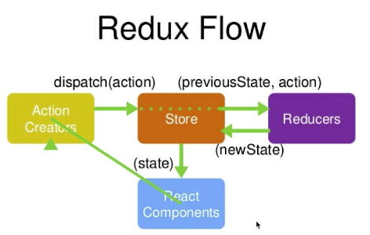

# store

## store的数据流图


## store创建的代码
+ 1.npm安装Redux
+ 2.在store文件夹下创建index.js，并导入
    ```javascript
    import { createStore } from 'redux'
    ```
+ 3.在store文件夹下创建reducer.js
    ```javascript
    const defaultState = {
        inputValue:'123'
    };
    
    export default (state = defaultState,action) => {
        return state;
    }
    ```
+ 4.index.js中
    ```javascript
    const store = createStore(reducer);
    ````
+ 5.在组件中引入，先`import store from xxx`,然后
    ```javascript
    this.state = store.getState()
    ```

## 改变store中数据的流程

+ 1 react要改变stroe里的数据，先要派发一个action，action通过dispatch(action)方法传给store
    ```javascript
    // src/TodoList.js
    // 修改store第1步：创建action，并通过dispatch传给store
    const action = {
        // 告诉store要做的事情
        type: 'change_input_value',
        value: e.target.value
    };
    store.dispatch(action);
    ```
+ 2 store 把之前的数据和`action(previousState, action)`传个reducer--**自动进行地，不需要人为干预**
+ 3 reducer是个函数，它接收了state和action以后做些处理会返回一个新的newState给到store
    ```javascript
      // src/store/reducer.js
      // reducer相当于笔记本，用于记录借书记录.state相当于笔记本里的数据
      const defaultState = {
          // todolist的默认数据
          inputValue: '123',
          list: ['梁山广', '王蕊', "女儿"]
      };
      
      // state指上一次的存储在store中的数据，action指用户要进行的操作(在组件里构造地)
      export default (state = defaultState, action) => {
          // 修改store数据第2步：redux自动把action（previousState，action）传给reducer
          // console.log(state, action);
          // 修改store数据第3步：自定义逻辑决定怎么更新state，然后把新的state返回后更新store
          if (action.type === 'change_input_value') {
              // 深拷贝重新创建一个state.需要深拷贝是因为reducer只能接收state但是绝不能修改state
              const newState = JSON.parse(JSON.stringify(state));
              newState.inputValue = action.value;
              // 返回新state给store(见store目录下的index.js)
              return newState;
          }
          return state;
      }

    ```
+ 4 store用这个新的state替换到原来的数据，store数据改变了以后，react组件感受到了数据变化，它会从
store里面重新取数据，更新组件的内容，页面就会跟着发生变化了
    ```javascript
    // src/store/index.js
    // store 相当于图书管理员
    import {createStore} from 'redux'
    // 引入笔记本
    import reducer from "./reducer";
    
    const store = createStore(
        // 修改store数据第4步：store接收reducer传过来的新state，更新原来的state，完成store的更新
        reducer,
        // 启用chrome里的redux调试工具
        window.__REDUX_DEVTOOLS_EXTENSION__ && window.__REDUX_DEVTOOLS_EXTENSION__()
    );
    
    export default store;
    ```
    
## Redux的三个基本原则

+ 1、store必须是惟一的
+ 2、只有store能够改变自己的内容
+ 3、Reducer必须是**纯函数纯函数**(给定固定输入，就一定会有固定的输出，而且不会有任何副作用)

## redux核心api： 
+ `createStore`：创建store；
+ `store.dispatch`：派发action，action会传递给store。
+ `store.getState`：获取到store里面所有的数据。
+ `store.subscribe`：订阅store的改变，store改变会触发store.subscribe接受的回调函数执行。
