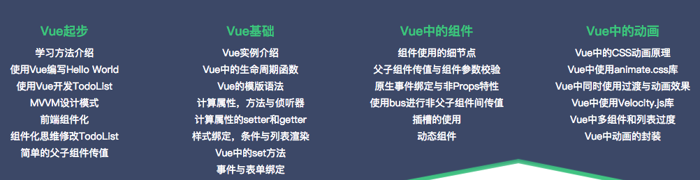

# VueStudy

> Vue学习笔记（4套视频课程+1本书）

+ WhereToGo:慕课网[《Vue2.5开发去哪儿网App》](https://coding.imooc.com/learn/list/203.html)
  
+ VueJsInAction:[《Vue.js实战》梁灏 著](https://item.jd.com/12215519.html)
+ VueBasicAndShareBike: [51CTO上的Vue学习+共享单车项目](http://edu.51cto.com/course/10906.html)
  + 
+ VueSell:慕课网课程[Vue.js2.5+cube-ui重构饿了么App](https://coding.imooc.com/learn/list/74.html)
+ VueJD:51CTO课程[2019全新vue2.5项目实战全家桶单页面仿京东电商实战](https://edu.51cto.com/course/17237.html)
