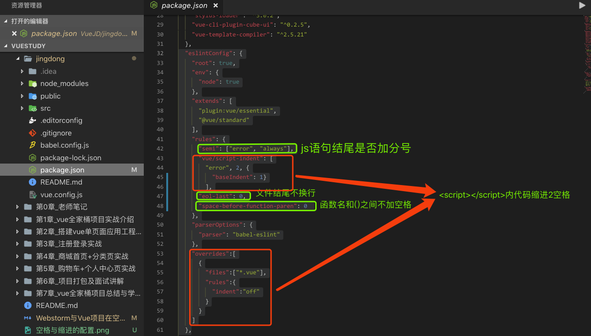

# WebStorm与Vue脚手架在空格缩进分号的格式化统一

> 当WebStorm和Vue的脚手架的代码格式要求不同意时，在WebStorm中执行代码格式化时会报一堆错

## 参考博文

+ [Vue 设置 Script 标签首层不缩进](https://www.jianshu.com/p/622c463ff925)
+ [解决eslint与webstorm关于script标签的缩进问题](https://blog.csdn.net/tozeroblog/article/details/85346166)
+ [彻底解决eslint与webstorm针对vue的script标签缩进处理方式冲突问题](https://blog.csdn.net/lpw_cn/article/details/84899742)
+ [eslint 有没有办法自己格式化一些分号，空格的问题](https://segmentfault.com/q/1010000009026964)
+ [JavaScript 中语句的分号及webstorm对其的设置](https://blog.csdn.net/m0_37604745/article/details/79032653)
+ [通过设置webstorm中的设置使得其函数名与括号之间有一个空格](https://blog.csdn.net/tozeroblog/article/details/85346224)，这个规则无疑问，改Webstorm即可

## WebStorm和Vue脚手架的默认规则的不同之处

| 比较                 | WebStorm     | Vue脚手架 | 推荐方案 |
| ---------------------- | ------------ | --------- | -------- |
| script标签内的缩进 | 缩进两个空格 | 不缩进 | 均可   |
| js语句最后的分号 | 该加就加 | 禁止分号 | 均可   |
| 函数名和括号之间的空格 | 无          | 有       | 后者   |

## Vue脚手架适配

+ 1.script标签内需要缩进2空格
  > 参考博文 [解决eslint与webstorm关于script标签的缩进问题](https://blog.csdn.net/tozeroblog/article/details/85346166)
+ 2.js语句强制加分号
+ 3.函数名和()之间不空格
+ 4.文件末尾不换行

只需要改package.json里的eslintConfig字段即可

```javascript
"eslintConfig": {
"root": true,
"env": {
  "node": true
},
"extends": [
  "plugin:vue/essential",
  "@vue/standard"
],
"rules": {
  "semi": ["error", "always"],
  "vue/script-indent": [
    "error", 2, {
      "baseIndent": 1}
    ],
  "eol-last": 0,
  "space-before-function-paren": 0 
},
"parserOptions": {
  "parser": "babel-eslint"
},
"overrides":[
  {
    "files":["*.vue"],
    "rules":{
      "indent":"off"
    }
  }
]
},
```

图示如下：



### WebStorm适配

+ 1.script标签内不需要缩进
  > 参考博文 [Vue设置script标签首层不缩进](https://www.jianshu.com/p/622c463ff925)  
  Webstorm配置好了，在`Code Style > HTML > Other > Do not indent children of`里面加上script,方法如下图
  
+ 2.js语句禁止加分号
  > 参考博文 [JavaScript中语句的分号及webstorm对其的设置](https://blog.csdn.net/m0_37604745/article/details/79032653)  
  
+ 3.函数名和()之间加空格
  > 参考博文 [通过设置webstorm中的设置使得其函数名与括号之间有一个空格](https://blog.csdn.net/tozeroblog/article/details/85346224)
  
+ 4.`import`多个模块时，`{}`与模块名之间有空格  
  
+ 5.对象赋值大括号与内部变量之间的空格  
  