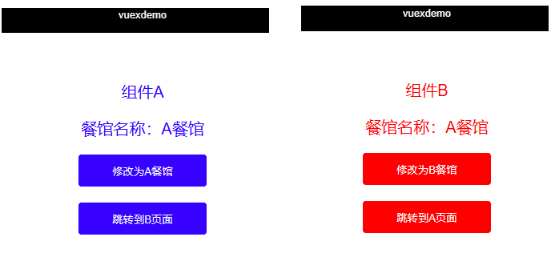
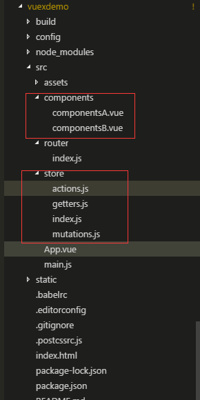
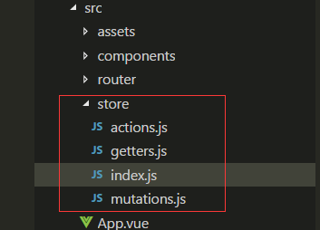

# vuex最详细完整的使用用法

> 转载自文章 [vuex最详细完整的使用用法](https://blog.csdn.net/qq_35430000/article/details/79412664)

## 为什么使用vuex

vuex主要是是做数据交互，父子组件传值可以很容易办到，但是兄弟组件间传值（兄弟组件下又有父子组件），或者大型spa单页面框架项目，页面多并且一层嵌套一层的传值，异常麻烦，用vuex来维护共有的状态或数据会显得得心应手。

需求：两个组件A和B，vuex维护的公共数据是 餐馆的名称 resturantName,默认餐馆名称是 飞歌餐馆，那么现在A和B页面显示的就是飞歌餐馆。如果A修改餐馆名称 为 A餐馆，则B页面显示的将会是 A餐馆，反之B修改同理。这就是vuex维护公共状态或数据的魅力，在一个地方修改了数据，在这个项目的其他页面都会变成这个数据。



## vuex原理

> 参考 [vuex官方文档](https://vuex.vuejs.org/zh/)

核心图如下：

[vuex原理图](images/vuex原理图.png)

## vuex的使用步骤

### 1.使用 vue-cli脚手架工具创建一个工程项目，工程目录，创建组件A和组件B路由如下



路由router.js如下

```javascript
import Vue from 'vue'
import Router from 'vue-router'
import componentsA from '@/components/componentsA'
import componentsB from '@/components/componentsB'

Vue.use(Router)

export default new Router({
   mode: 'history',
    routes: [
        {
        path: '/',
        name: 'componentsA',
        component: componentsA
        },
        {
            path: '/componentsA',
            name: 'componentsA',
            component: componentsA
        },
        {
            path: '/componentsB',
            name: 'componentsB',
            component: componentsB
        }
    ]
})
```

入口文件App.vue

```vue
<template>
  <div id="app">
    <router-view/>
  </div>
</template>

<script>
export default {
  name: 'App'
}
</script>

<style>
#app {
  font-family: 'Avenir', Helvetica, Arial, sans-serif;
  -webkit-font-smoothing: antialiased;
  -moz-osx-font-smoothing: grayscale;
  text-align: center;
  color: #2c3e50;
  margin-top: 60px;
}
</style>
```

### 2.开始使用vuex，新建一个 sotre文件夹，分开维护 actions mutations getters



store文件夹内各个文件内容如下：

#### index.js

> 新建vuex 的store实例, *as的意思是 导入这个文件里面的所有内容，就不用一个个实例来导入了

```javascript
import Vue from 'vue'
import Vuex from 'vuex'
import * as getters from './getters' // 导入响应的模块，*相当于引入了这个组件下所有导出的事例
import * as actions from './actions'
import * as mutations from './mutations'

Vue.use(Vuex)
// 首先声明一个需要全局维护的状态 state,比如 我这里举例的resturantName
const state = {
    resturantName: '飞歌餐馆' // 默认值
    // id: xxx  如果还有全局状态也可以在这里添加
    // name:xxx
}

// 注册上面引入的各大模块
const store = new Vuex.Store({
    state,    // 共同维护的一个状态，state里面可以是很多个全局状态
    getters,  // 获取数据并渲染
    actions,  // 数据的异步操作
    mutations  // 处理数据的唯一途径，state的改变或赋值只能在这里
})

export default store  // 导出store并在 main.js中引用注册。
```

#### actions.js

> 参考 https://vuex.vuejs.org/zh/guide/actions.html#action

+ Action提交的是mutation，而不是直接变更状态
+ Action可以包含任意`异步操作`

```javascript
// 给action注册事件处理函数。当这个函数被触发时候，将状态提交到mutations中处理
export function modifyAName({commit}, name) { // commit 提交；name即为点击后传递过来的参数，此时是 'A餐馆'
    return commit ('modifyAName', name)
}
export function modifyBName({commit}, name) {
    return commit ('modifyBName', name)
}

// ES6精简写法
// export const modifyAName = ({commit},name) => commit('modifyAName', name)
```

#### mutations.js

> 参考文章 https://vuex.vuejs.org/zh/guide/mutations.html#mutation

+ 更改 Vuex 的 store 中的状态的唯一方法是提交 mutation
+ Vuex 中的 mutation 非常类似于事件
+ 你不能直接调用一个 mutation handler， 你需要以相应的 type 调用 store.commit 方法

```javascript
// 提交 mutations是更改Vuex状态的唯一合法方法
export const modifyAName = (state, name) => { // A组件点击更改餐馆名称为 A餐馆
    state.resturantName = name // 把方法传递过来的参数，赋值给state中的resturantName
}
export const modifyBName = (state, name) => { // B组件点击更改餐馆名称为 B餐馆
    state.resturantName = name
}
```

#### getters.js

```javascript
// 获取最终的状态信息
export const resturantName = state => state.resturantName
```

### 3.在main.js中导入 store实例

main.js内容如下

```javascript
// The Vue build version to load with the `import` command
// (runtime-only or standalone) has been set in webpack.base.conf with an alias.
import Vue from 'vue'
import App from './App'
import router from './router'
import store from './store'

Vue.config.productionTip = false

/* eslint-disable no-new */
new Vue({
  el: '#app',
  router,
  store,  // 这样就能全局使用vuex了
  components: { App },
  template: '<App/>'
})
```

### 4.在组件A中，定义点击事件，点击 修改 餐馆的名称，并把餐馆的名称在事件中用参数进行传递

`..mapactions` 和 `...mapgetters`都是vuex提供的**语法糖**，在底层已经封装好了，拿来就能用，简化了很多操作。

其中`...mapActions(['clickAFn'])` 相当于`this.$store.dispatch('clickAFn'，{参数})`，mapActions中只需要指定方法名即可，参数省略。

`...mapGetters(['resturantName'])`相当于`this.$store.getters.resturantName`,相当于引用全局变量

componentsA.vue内容如下

```vue
<template>
  <div class="componentsA">
      <P class="title">组件A</P>
      <P class="titleName">餐馆名称：{{resturantName}}</P>
      <div>
            <!-- 点击修改 为 A 餐馆 -->
          <button class="btn" @click="modifyAName('A餐馆')">修改为A餐馆</button>
      </div>
      <div class="marTop">
          <button class="btn" @click="trunToB">跳转到B页面</button>
      </div>
  </div>
</template>

<script>
import {mapActions, mapGetters} from 'vuex'
export default {
  name: 'A',
  data () {
    return {
    }
  },
  methods:{
      ...mapActions( // 语法糖
          ['modifyAName'] // 相当于this.$store.dispatch('modifyName'),提交这个方法
      ),
      trunToB () {
          this.$router.push({path: '/componentsB'}) // 路由跳转到B
      }
  },
  computed: {
      ...mapGetters(['resturantName']) // 动态计算属性，相当于this.$store.getters.resturantName
  }
}
</script>

<!-- Add "scoped" attribute to limit CSS to this component only -->
<style scoped>
    .title,.titleName{
        color: blue;
        font-size: 20px;
    }
    .btn{
        width: 160px;
        height: 40px;
        background-color: blue;
        border: none;
        outline: none;
        color: #ffffff;
        border-radius: 4px;
    }
    .marTop{
        margin-top: 20px;
    }
</style>
```

componentsB.vue内容同理，如下

```vue
<template>
  <div class="componentsB">
      <P class="title">组件B</P>
      <P class="titleName">餐馆名称：{{resturantName}}</P>
      <div>
          <!-- 点击修改 为 B 餐馆 -->
          <button class="btn" @click="modifyBName('B餐馆')">修改为B餐馆</button>
      </div>
      <div class="marTop">
          <button class="btn" @click="trunToA">跳转到A页面</button>
      </div>
  </div>
</template>

<script>
import {mapActions, mapGetters} from 'vuex'
export default {
  name: 'B',
  data () {
    return {
    }
  },
  methods:{
      ...mapActions( // 语法糖
          ['modifyBName'] // 相当于this.$store.dispatch('modifyName'),提交这个方法
      ),
      trunToA () {
          this.$router.push({path: '/componentsA'}) // 路由跳转到A
      }
  },
  computed: {
      ...mapGetters(['resturantName']) // 动态计算属性，相当于this.$store.getters.resturantName
  }
}
</script>

<!-- Add "scoped" attribute to limit CSS to this component only -->
<style scoped>
    .title,.titleName{
        color: red;
        font-size: 20px;
    }
    .btn{
        width: 160px;
        height: 40px;
        background-color: red;
        border: none;
        outline: none;
        color: #ffffff;
        border-radius: 4px;
    }
    .marTop{
        margin-top: 20px;
    }
</style>
```

## 5.我的优化1:将state单独提出来，方便维护

> 源码见 [myvuex](myvuex)

+ 在store目录下新建一个state.js，把index.js的内容迁移到state.js中，内容如下

```javascript
// 首先声明一个需要全局维护的状态 state,比如 我这里举例的resturantName

let defaultResturantName = '飞歌餐馆'

// 首先声明一个需要全局维护的状态 state,比如 我这里举例的resturantName
export default {
  resturantName: defaultResturantName // 默认值
  // id: xxx  如果还有全局状态也可以在这里添加
  // name:xxx
}
```

+ 然后在index.js中引入state.js

```javascript
import Vue from 'vue'
import Vuex from 'vuex'
import * as getters from './getters' // 导入响应的模块，*相当于引入了这个组件下所有导出的事例
import * as actions from './actions'
import * as mutations from './mutations'
import state from './state'

Vue.use(Vuex)

// 注册上面引入的各大模块
const store = new Vuex.Store({
  state, // 共同维护的一个状态，state里面可以是很多个全局状态
  getters, // 获取数据并渲染
  actions, // 数据的异步操作
  mutations // 处理数据的唯一途径，state的改变或赋值只能在这里
})

export default store // 导出store并在 main.js中引用注册。
```

## 6.我的优化2：因为不要异步所以去掉actions.js，获取vuex变量直接用this.$store.state.xxx即可，去掉getters.js, state作为变量单独提取出来成state.js

> 完整代码见 [myvuex_simplify](myvuex_simplify)

store目录下现在只有3个文件，index.js、state.js和mutations.js,内容分别如下

### store/index.js

```javascript
import Vue from 'vue'
import Vuex from 'vuex'
import mutations from './mutations'
import state from './state'

Vue.use(Vuex)

// 注册上面引入的各大模块
export default new Vuex.Store({
  state, // 共同维护的一个状态，state里面可以是很多个全局状态
  mutations // 处理数据的唯一途径，state的改变或赋值只能在这里
})
```

### store/state.js

```javascript
let defaultResturantName = '飞歌餐馆'

// 首先声明一个需要全局维护的状态 state,比如 我这里举例的resturantName
export default {
  resturantName: defaultResturantName // 默认值
  // id: xxx  如果还有全局状态也可以在这里添加
  // name:xxx
}
```

### store/mutations.js

```javascript

// 提交 mutations是更改Vuex状态的唯一合法方法
export default {

  modifyAName (state, name) {
    state.resturantName = name // A组件点击更改餐馆名称为 A餐馆
  },
  modifyBName (state, name) { // B组件点击更改餐馆名称为 B餐馆
    state.resturantName = name
  }
}
```