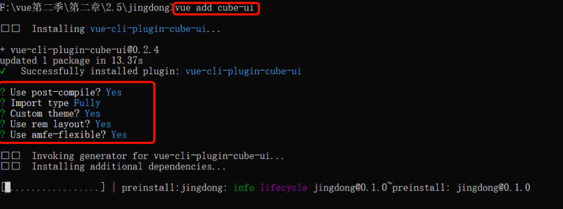
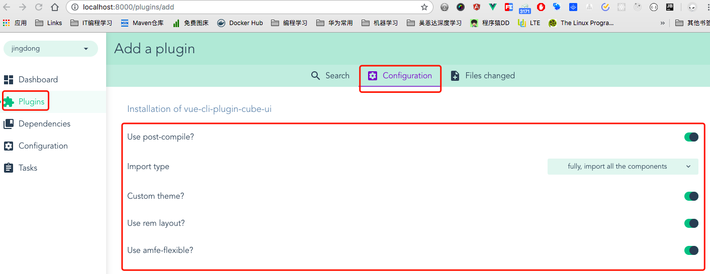

# 2-5_实战系列之安装使用ui框架-----cube-ui.md

+ vuecli3.x版本安装：`vue add cube-ui`
+ [cube-ui教程](https://didi.github.io/cube-ui/#/zh-CN/docs/quick-start)
+ [安装cube-ui的配置选择](https://github.com/cube-ui/cube-template/wiki)
+ 详细的安装和配置可见 [cube-ui的安装和配置](../../VueSell/第2章_项目准备工作/README.md#cube-ui的安装和配置)
+ 命令行方法配置cube-ui  
  
+ 网站界面配置cube-ui
  
