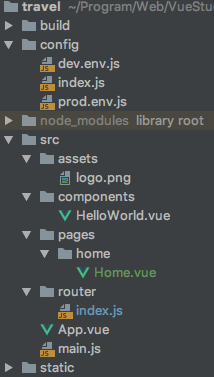
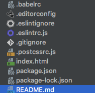
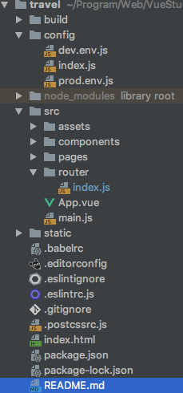

# pc

> PC上vue项目的基础模板

## Build Setup

``` bash
# install dependencies
npm install

# serve with hot reload at localhost:8080
npm run dev

# build for production with minification
npm run build

# build for production and view the bundle analyzer report
npm run build --report
```

For a detailed explanation on how things work, check out the [guide](http://vuejs-templates.github.io/webpack/) and [docs for vue-loader](http://vuejs.github.io/vue-loader).

## 项目结构说明

### 文件夹说明
+ build放的webpack打包的配置
+ config 项目配置文件夹 
    + index.js -- 基础配置信息；
    + dev.env.js -- 开发环境的配置；
    + prod.env.js -- 线上环境配置信息
+ node_modules:依赖包
+ src 源代码
    + assets:存放项目中使用到的图片类资源
    + comm:存放项目中使用到的一些小组件(公共组件)
    + pages:存放网站的组合页面，通常是做好骨架后从components中进行组织
    + router/index.js:存放项目的所有路由
    + App.vue:项目最原始的跟组件
    + main.js:项目入口文件
+ static 放的静态资源



### 文件说明
+ .babelrc -- 语法解析器配置项  将vue转换成浏览器能执行的代码
+ .editorconfig -- 编辑器的配置项
+ .eslintignore -- 这里面的配置项不受eslint工具(.eslintrc.js里配置的)的检测
+ .eslintrc.js -- 配置了一些代码的规范
+ .gitignore -- 配置不需要上传的文件
+ .postcssrc.js -- postcss的配置文件
+ index.html -- 项目入口，整个项目的挂载点
+ package.json -- 存放依赖包
+ package-lock.json -- package锁文件 确定第三方包的版本
+ README.md --项目说明包
+ LICENSE -- 开源协议的说明



### 项目结构整体图示



### 代码的说明

+ 1. router，路由就是根据网址的不同，返回不同的内容给用户。
+ 2. router-view，显示的是当前路由地址所对应的内容。
+ 3. es6 语法中，键值对相同时只写一个就可以。
+ 4. @符号表示 src 目录

### 页面的跳转
+ 使用方式 
    ```vue
      <router-link to="跳转页面的router"></router-link>
    ```
+ 多页应用：每次页面跳转，后端返回新的HTML文件，优点：首屏时间快，SEO效果好，缺点：页面切换慢。
+ 单页应用：每次页面跳转，JS感知到路由的变化，于是清除当前页面的内容，挂载新的内容到页面中。优点：页面切换快，缺点：首屏时间稍慢，SEO差。


 

