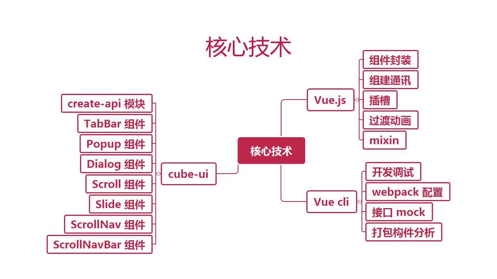

# 第1章 课程导学

## 1-1 导学

### 课程概述

+ 做什么？开发体验媲美原生APP 的饿了么商家页面
+ 哪些内容?商家列表页、评价页、商家页面、各种组件
+ 技术栈? Vuejs 2.5.17、 Vue-Cu 3.0、 Cube-UI

### 核心技术(待替换为本地图片)

### 课程安排

+ 第1章:准备工作
+ 第2~7章:实战开发
+ 第8章:create-api原理介绍
+ 第9章:项目打包和部署
+ 第10章:总结

### 讲授方式

+ 按照APP的功能依次开发页面组件
+ 先谈思路，再聊实现
+ 手写每一行JS代码，弱化CSS部分

### 课程收获

+ 学会使用Vue.js开发WebApp应用
+ 学会组件化和模块化的方式
+ 学会使用第三方组件辅助我们的开发
+ 学会项目的部署和构建过程
