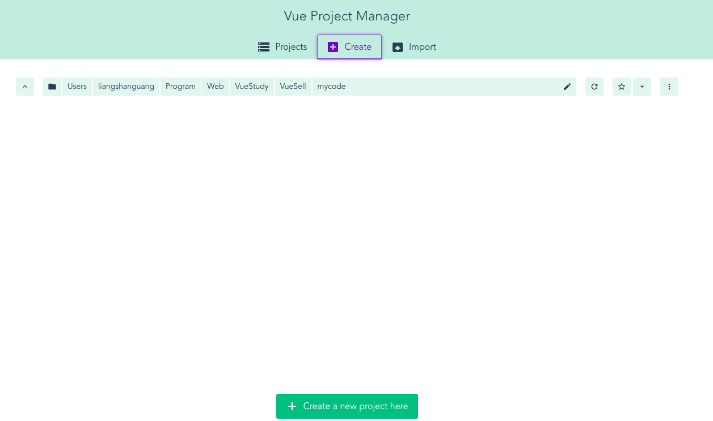
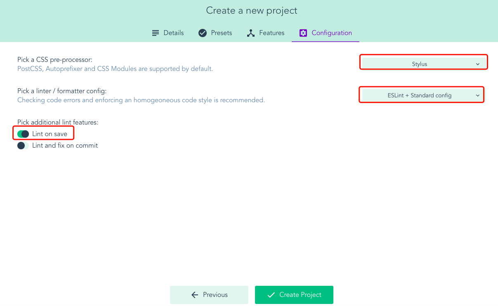

# 第2章 项目准备工作

## 2-1 Vue-cli 3.0 介绍

### 资源

+ [github](https://github.com/vuejs/vue-cli)
+ [文档地址](https://cli.vuejs.org/zh/)

### 安装

+ 卸载原来旧版本的vue-cli
 Vue CLI 的包名称由 vue-cli 改成了 @vue/cli。 如果你已经全局安装了旧版本的 vue-cli (1.x 或 2.x)，你需要先通过 `npm uninstall vue-cli -g` 或 `yarn global remove vue-cli` 卸载它

+ 安装最新版本的vue-cli

 ```shell
 npm install -g @vue/cli
 npm install -g @vue/cli-service-global
 ```

+ 安装完毕，验证下

  ```shell
  vue --version # 查看vue-cli版本
  vue -h # 查看vue命令的选项和使用说明
  ```

### 创建项目

#### 命令行

```shell
vue create vue-sell-cube
```

然后出现的选项依次如下：  


#### 使用 Vue UI

> 推荐该方法

+ 1.启动Vue UI

  ```shell
  vue ui
  ```

  然后会自动打开 http://localhost:8000 ，下面从这个网站里创建项目,点击`Create a new project here`即可开始创建Vue项目
  

+ 2.创建项目  
  

+ 3.选择"手动配置"  
  

+ 4.选择需要的插件  
  

+ 5.选择CSS预处理器和Lint工具配置  
  

+ preset是否保存？no，`Continue without saving`  
  

+ 创建后的Dashboard如下
  

### 运行项目

#### 命令行

```shell
cd vue-sell-cube
vue serve
```

#### Vue UI

> 推荐


## 2-2 目录介绍和cube-ui安装

### vue-cli3初始化后的项目目录及介绍  


```txt
|—node-modules：依赖的node库文件
|—public：公共文件，如index.html入口文件，最终所有组件都渲染到这里
|—src
    |—assets：资源文件img、css、html等等
    |—component：组件
    |—App.vue：vue的根组件
    |—main.js：主函数入口文件
|—package.json：项目描述文件
|—package-lock.json：项目依赖库版本锁定
```

+ eslint规则的配置不能在项目中直接改了，需要在vue-ui的界面里配置，，或者在vue.config.js中配置
  
+ 项目的根路径`Public Path`和build输出目录都在网址  里面配置，也可以在vue.config.js中配置
  

### cube-ui的安装和配置

#### 命令行

```shell
vue add cube-ui
```

会有一些让你选择的项，具体如下图：


#### Vue UI

+ 点击Add plugin
  

+ 在插件市场搜索cube，找到cube-ui进行安装
  

+ 安装完毕会提示进行cube-ui的配置，如下图选择即可
  

+ 安装完毕，项目添加&修改的文件列表如下图
  

### 重新启动项目，可以看到网站有明显的变化

在 http://localhost:8000/tasks 里的serve任务里先Stop task再点击Run task即可

## 2-3 API接口mock

> 关于vue.config.js的介绍和使用可以参考 [如何配置 vue-cli 3.0 的 vue.config.js
> ](https://segmentfault.com/a/1190000016101954?utm_source=tag-newest)

[如何配置 vue-cli 3.0 的 vue.config.js 本地pdf版](如何配置vue-cli3.0的vue_config_js.pdf)

+ 把data.json拷贝到项目的根目录，data.json 见https://git.imooc.com/19920625lsg/coding-74/src/next/data.json
+ 配置vue.config.js，配置完后如下,主要是开头三个const变量和字段devServer的配置

  ```javascript
  const appData = require('./data')
  const seller = appData.seller
  const goods = appData.goods
  const ratings = appData.ratings

  module.exports = {
    css: {
      loaderOptions: {
        stylus: {
          'resolve url': true,
          'import': [
            './src/theme'
          ]
        }
      }
    },
    pluginOptions: {
      'cube-ui': {
        postCompile: true,
        theme: true
      }
    },
    devServer: {
      before: app => {
        app.get('/api/seller', function (req, res) {
          res.json({
            errno: 0,
            data: seller
          })
        })
        app.get('/api/goods', function (req, res) {
          res.json({
            errno: 0,
            data: goods
          })
        })
        app.get('/api/ratings', function (req, res) {
          res.json({
            errno: 0,
            data: ratings
          })
        })
      }
    }
  }

  ```
  
 然后访问：http://ip:port/api/seller 、 http://ip:port/api/goods 、 http://ip:port/api/ratings 就可以分别访问数据了
