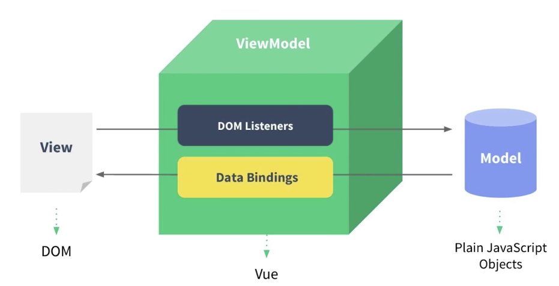

# MVVM模式

## MVP：
+     M：模型层
+     V：视图层
+     P：控制器层
>      View发出一个事件交给Presenter，控制器调取model或者直接操作View，Presenter是核心 ，大部分的工作都在Presenter层
## MVVM：
+     M：负责存储数据（模型层，Model）
+     V：负责显示数据（视图层, View）
+     VM：Vue自带的层（内置 ViewModel）
>     最重的是M层，dom操作被极大简化，使用MVVM是面向数据进行编程

## 组件化
> 每个组件就是页面上的一个部分
  把一个大型项目切分成一个一个部分，拆分成一个一个组件，每个组件维护相对容易一些
