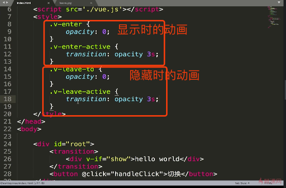
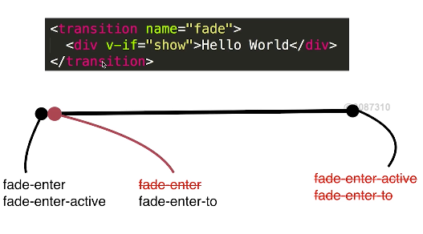
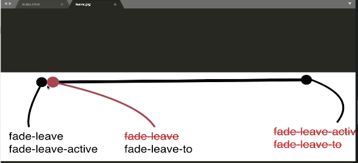

## vue中css动画原理：在某个特定时间内给标签加上某些样式
+ 在需要设置动画的dom 节点外层包裹 transition 标签，可以添加 name 属性。
+ 没有name 属性时，css书写为 v-enter => v-enter-active; v-leave-to => v-leave-active
有name 属性时，  将前缀v改为自定义name属性的值。代码实现如下
    ```vue
    .v-enter,
    .v-leave-to{
        opacity: 0;
    }
    .v-enter-active,
    .v-leave-active{
        transition: opacity 2s;
    } 
    ```
  
> 在需要设置动画的dom元素外，用<transition>标签包裹， 同时可以添加一个name属性（name="fade"）
  没有name 属性时，css书写为 v-enter ——> v-enter-active （显示）; v-leave-to ——> v-leave-active（隐藏）
  有name 属性时，  将前缀v改为自定义name属性的值。 
    
    
## Vue动画的图解
> Vue里css动画实现原理：
  给元素或者组件外包裹一层transition标签后，transition包裹的标签显示和隐藏时，vue会自动给标签在某一时间点添加class类名，比如显示的时候，最开始一瞬间会添加上v-enter和v-enter-active，在第二瞬间会将v-enter去除新增v-enter-to类，周期的最后时间会将所有添加的类名去除，我们就是通过给整个周期里不同类名设置不同的css状态，实现的css3动画。
  


