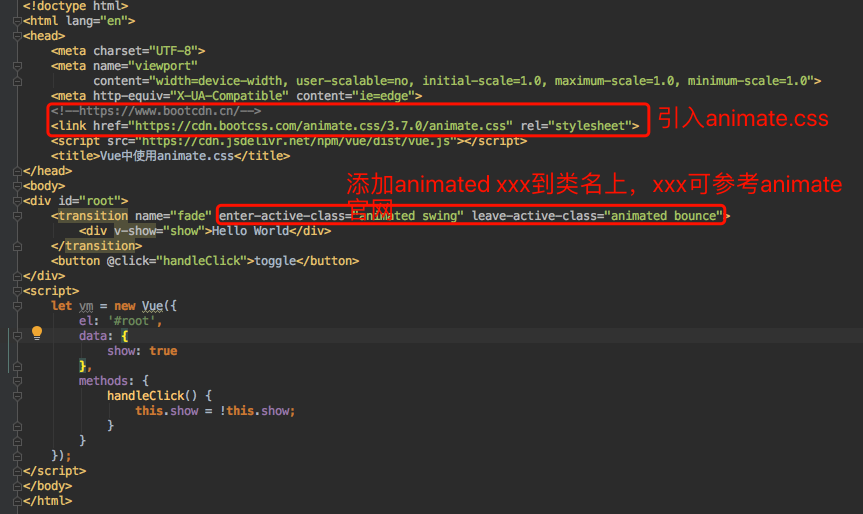

# Vue中使用animate.css

+ [官网](https://github.com/daneden/animate.css)
+ [介绍文档](https://daneden.github.io/animate.css/)
+ [cdn地址](https://cdn.bootcss.com/animate.css/3.7.0/animate.css)
+ [CDN仓库，有常见的所有前端库](https://www.bootcdn.cn)
+ 在vue中的使用方法
    > 使用animate.css，只要在需要动画的标签外的transition标签里添加对应属性，比如enter-active-class=“animated swing”，leave-active-class=“animated shake”即可，但前提得引入animate.css
    
