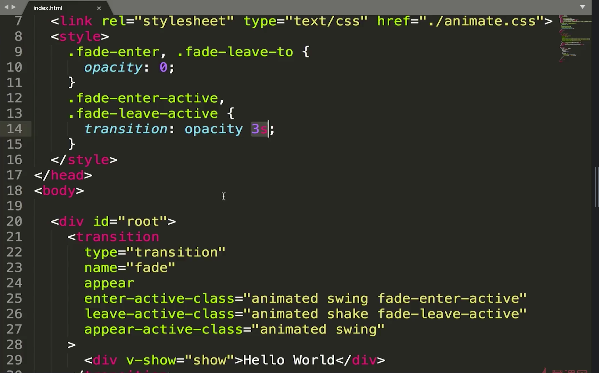

# Vue动画总结

+ 1.在需要设置过度动画的元素外包裹<transition>标签，然后再设置对应的样式即可（v-enter,v-enter-active;v-leave-to,v-leave-active)
+ 2.如果不想用默认的类，可以自定义类如：`enter-active-class="active"`,然后写.active的样式即可
+ 3.使用animate.css，只要在需要动画的标签外的transition标签里添加对应属性，比如enter-active-class=“animated swing”，leave-active-class=“animated shake”即可，但前提得引入animate.css
    > 123的代码实例如下：
    
+ 4.若想一加载就有动画效果需加入appear属性和自定义class：appear-active-class="自定义类名"
+ 5.同时存在过渡动画和其他动画，但时长不一样时，可以设置type属性来决定以谁为准，如：type="transition"则以过渡动画的时长为准
    > 45的代码范例如下：
    
+ 6.当要自定义时长时可以这样， ：duration="3000" 以毫秒计，这样的话不会以动画时长为准，而是自己定义的时长；更复杂点可以设置入场和出场动画时长，:duration="{enter:5000, leave:10000}"
    > 6自定义播放时长(duration单位是ms)，此处不再举例
    

