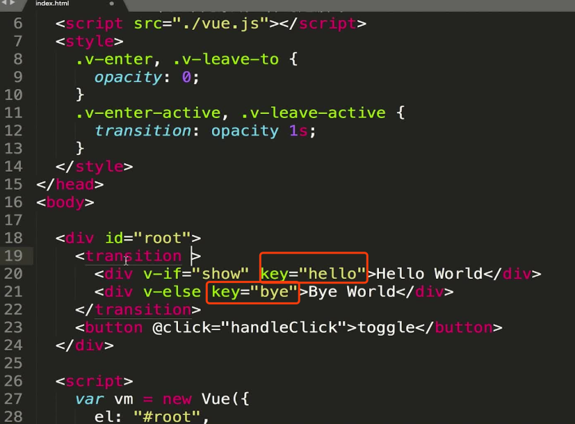
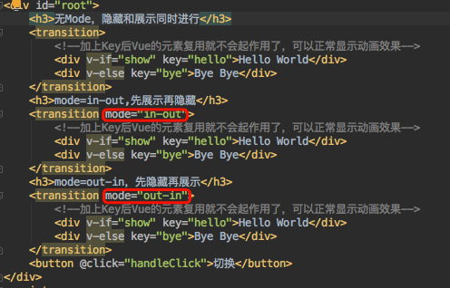
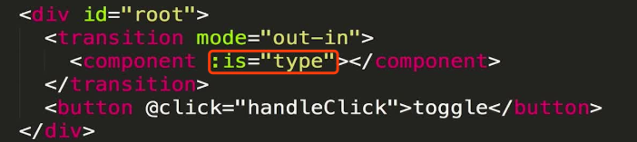

## 多组件和多元素的过渡

### 基础组件实现多组件过渡
+ 1. 因vue中的复用机制，此处动画不会执行，可给元素添加唯一的key值来使vue对该元素不进行复用
    
+ 2. 先进入执行还是先出去执行，可在<transition>元素上设置： mode="in-out" 或mode="out-in"
    
+ 3. 组件的过渡和普通元素的用法一致
+ 4. 动态组件的过渡须在动态组件内绑定is属性
    
    
### 一个范例代码

```vue
<transition mode="in-out">
    <!--动态组件-->
    <component :is="type"></component>
    <!--组件-->
    <child-one v-if="show"></child-one>
    <child-two v-else></child-two>
    <!--多个同名元素过渡通过唯一key阻止vue复用-->
    <div v-if="show" key="hello">Hello world</div>
    <div v-else key="bye">Bye World</div>
</transition>
```
